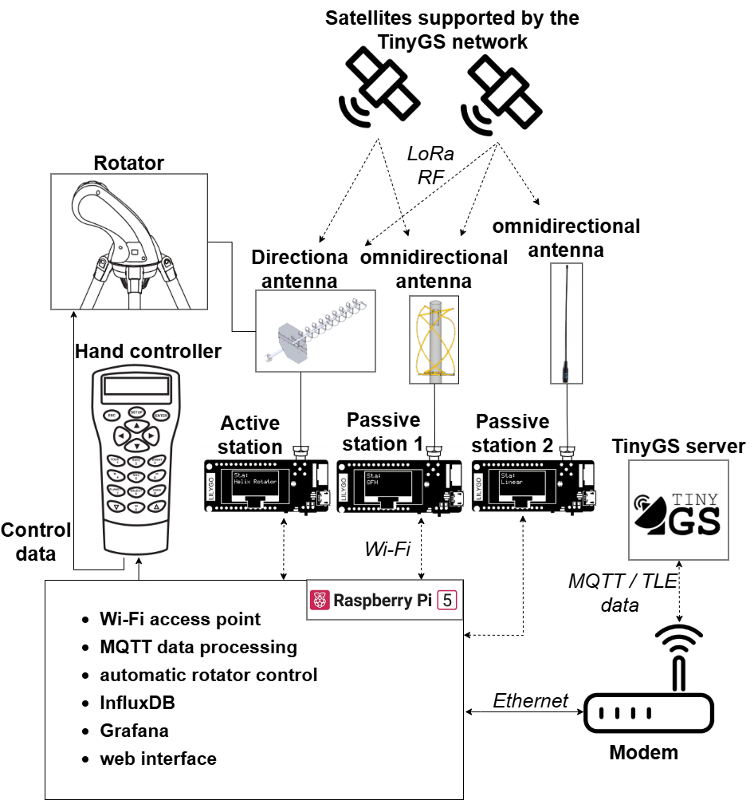
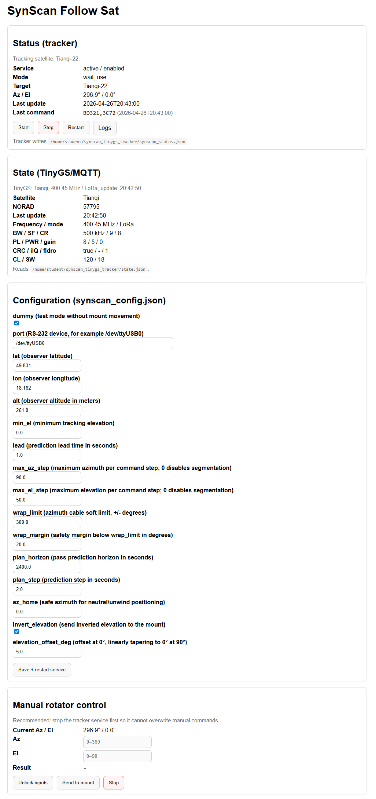
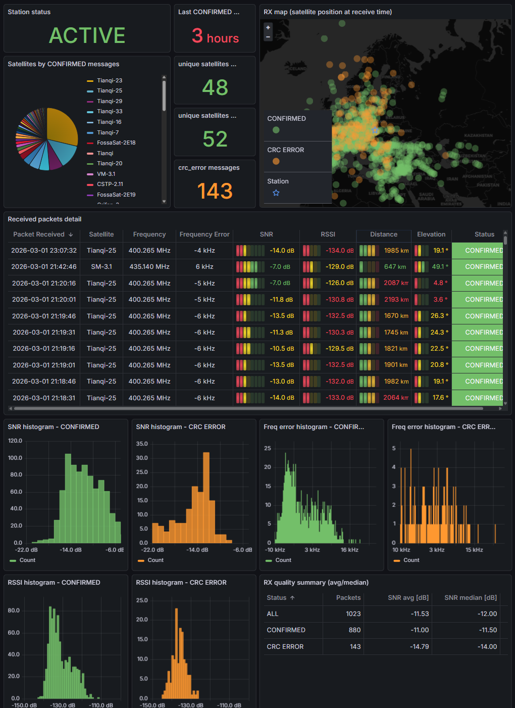

# SynScan TinyGS Tracker

This project tracks satellites with a SynScan mount, using TinyGS MQTT state updates and local TLE data.

## What This Is

- A Debian/Raspberry Pi control layer that connects TinyGS MQTT data with a SynScan antenna rotator.
- It reads the currently relevant satellite from TinyGS state updates, resolves it by NORAD, and computes azimuth/elevation from local TLE data.
- It moves a directional antenna automatically, while also exposing a web UI for status, config changes, logs, and manual override.
- It can also store receive telemetry in InfluxDB/Grafana and run Passive 1 and Passive 2 monitor stations in parallel.

## Wiring Diagram



This diagram reflects the intended project layout: one directional station on a SynScan rotator, optional passive stations, and a Debian host that glues TinyGS, control, and observability together.

## Minimum Hardware Setup

- A Debian machine, typically a Raspberry Pi 5, with Python 3.10+ and `systemd`.
- One SynScan-compatible mount/rotator connected over serial or USB-to-serial.
- One directional antenna connected to a TinyGS-compatible ESP32 LoRa receiver.
- Network access from the Debian host to the TinyGS MQTT/API backend.
- Local TLE data and TinyGS credentials configured in this repository.

Optional but supported:

- Additional ESP32 LoRa receivers with passive antennas for Passive 1 or Passive 2 monitoring.
- InfluxDB and Grafana for telemetry, pass analysis, and dashboards.

## Requirements

- Debian GNU/Linux with `systemd` (required for the provided service setup).
- Python 3.10+ (tested with Python 3.11).
- `git`, `python3-venv`, and `python3-pip`.
- Access to the serial port device for real mount mode.

Install baseline Debian packages:

```bash
sudo apt update
sudo apt install -y git python3 python3-venv python3-pip
```

For real mount mode, make sure the Linux user can open the serial adapter. On Debian this is usually the `dialout` group:

```bash
sudo usermod -aG dialout "$USER"
```

Log out and back in after changing groups. Python package installation is covered in the virtual environment step below.

## Repository Layout

- `docs/`: screenshots, wiring diagram, and detailed Grafana notes.
- `dashboards/`: the three Grafana dashboard JSON files.
- `examples/`: env file templates copied to local runtime env files.
- `systemd/`: service templates copied into `/etc/systemd/system/`.
- `tools/`: one-off helper scripts such as TLE download.
- `tracker/`: the tracker, MQTT listener, web UI, and shared runtime modules.

## Ultimate Beginner Guide (From Zero to Running System)

Use this as the single end-to-end path on a new Debian machine.

1. Clone and enter the project:

```bash
git clone https://github.com/MiraKnapovsky/SynScan-Satellite-Tracker-TinyGS.git "$HOME/synscan_tinygs_tracker"
cd "$HOME/synscan_tinygs_tracker"
```

2. Create virtual environment and install dependencies:

```bash
python3 -m venv tinygs_mqtt/env
source tinygs_mqtt/env/bin/activate
python -m pip install --upgrade pip
python -m pip install -r requirements.txt
```

3. Create local TinyGS credential file:

```bash
cp examples/mqtt_tinygs_listen.env.example mqtt_tinygs_listen.env
```

Edit `mqtt_tinygs_listen.env` and fill in:
- `TINYGS_USER`
- `TINYGS_STATION`
- `TINYGS_PASS`

4. Download current TLE data locally (required before tracking):

```bash
python3 tools/import_requests.py
```

5. Configure tracker in `synscan_config.json`:
- First safe setup: keep `dummy: true`. In this mode the tracker logs mount commands but does not open the serial port.
- Real movement later: set `dummy: false` and confirm `port`, `lat`, `lon`, `alt`.
- Target selection reads `NORAD` from `state.json`.
- Leave the default file paths unless you changed the project layout.

6. Load listener credentials into current shell:

```bash
set -a
source mqtt_tinygs_listen.env
set +a
```

7. Start MQTT listener manually (first validation run):

```bash
python3 tracker/mqtt_tinygs_listen.py \
  --user "$TINYGS_USER" \
  --station "$TINYGS_STATION" \
  --password "$TINYGS_PASS" \
  --out "$HOME/synscan_tinygs_tracker/state.json" \
  --frame-topic tinygs/${TINYGS_USER}/${TINYGS_STATION}/cmnd/frame/0
```

8. Verify that `state.json` is updating (open second terminal):

```bash
cat "$HOME/synscan_tinygs_tracker/state.json"
```

9. Start tracker loop (second terminal):

```bash
cd "$HOME/synscan_tinygs_tracker"
python3 tracker/synscan_runner.py
```

10. Start web UI (third terminal):

```bash
cd "$HOME/synscan_tinygs_tracker"
export SYNSCAN_WEB_PASSWORD=change-me
# optional:
# export SYNSCAN_WEB_USER=admin
# export SYNSCAN_WEB_HOST=0.0.0.0
# export SYNSCAN_WEB_PORT=8080
python3 tracker/synscan_web.py
```

Open `http://127.0.0.1:8080/config` locally.
If you set `SYNSCAN_WEB_HOST=0.0.0.0`, open `http://<debian-host-ip>:8080/config` from another machine.



The web UI shows tracker state, TinyGS/MQTT state, logs, service controls, a safe config form, and manual goto/stop controls.

11. Optional: install the template systemd units after the manual test passes:

```bash
sudo cp "$HOME/synscan_tinygs_tracker/systemd/mqtt_tinygs_listen@.service" /etc/systemd/system/
sudo cp "$HOME/synscan_tinygs_tracker/systemd/synscan-follow-sat@.service" /etc/systemd/system/
sudo cp "$HOME/synscan_tinygs_tracker/systemd/synscan-web@.service" /etc/systemd/system/
sudo systemctl daemon-reload
cp "$HOME/synscan_tinygs_tracker/examples/synscan_web.env.example" "$HOME/synscan_tinygs_tracker/synscan_web.env"
editor "$HOME/synscan_tinygs_tracker/synscan_web.env"
sudo systemctl enable --now mqtt_tinygs_listen@$(whoami).service
sudo systemctl enable --now synscan-follow-sat@$(whoami).service
sudo systemctl enable --now synscan-web@$(whoami).service
sudo systemctl status mqtt_tinygs_listen@$(whoami).service \
  synscan-follow-sat@$(whoami).service \
  synscan-web@$(whoami).service
```

12. Optional: restart the template units manually:

```bash
sudo systemctl restart mqtt_tinygs_listen@$(whoami).service
sudo systemctl restart synscan-follow-sat@$(whoami).service
sudo systemctl restart synscan-web@$(whoami).service
sudo systemctl status mqtt_tinygs_listen@$(whoami).service \
  synscan-follow-sat@$(whoami).service \
  synscan-web@$(whoami).service
```

The web UI can start/stop/restart the tracker service automatically when:

- `tracker/synscan_web.py` knows the correct tracker unit via `SYNSCAN_FOLLOW_SERVICE`
- the web process has permission to manage system services

The provided `systemd/synscan-web@.service` template sets `SYNSCAN_FOLLOW_SERVICE=synscan-follow-sat@<user>.service`.
For service control actions on Debian, the web process still needs passwordless permission to run `systemctl` for the tracker unit.
One narrow sudoers option is:

```bash
sudo visudo -f /etc/sudoers.d/synscan-web
```

Add this line, replacing `<user>` with the Linux user that runs the web service:

```text
<user> ALL=(root) NOPASSWD: /usr/bin/systemctl start synscan-follow-sat@<user>.service, /usr/bin/systemctl stop synscan-follow-sat@<user>.service, /usr/bin/systemctl restart synscan-follow-sat@<user>.service
```

Without that sudoers rule, the dashboard and logs still work, but the web Start/Stop/Restart buttons fail.

## InfluxDB + Grafana

`tracker/mqtt_tinygs_listen.py` can write TinyGS state and frame data directly to InfluxDB v2.



Dashboard files live in `dashboards/`. The repository includes only the three basic dashboards: active, passive1, and passive2. See `README_GRAFANA.md` for panel definitions and deployment steps.

Configuration is via env vars (already loaded by `mqtt_tinygs_listen@.service`):

```bash
# $HOME/synscan_tinygs_tracker/mqtt_tinygs_listen.env
INFLUXDB_URL=http://127.0.0.1:8086
INFLUXDB_ORG=your-org
INFLUXDB_BUCKET=tinygs_active
INFLUXDB_TOKEN=your-token
INFLUXDB_MEAS_FRAME=tinygs_frame
INFLUXDB_MEAS_STATE=tinygs_state
INFLUXDB_MEAS_META=tinygs_meta
# Optional custom CA bundle for MQTT TLS (when unset, system trust store is used)
TINYGS_CAFILE=/path/to/ca-bundle.pem
# Optional: tracker status source used to stamp tracked_norad into Influx points
TINYGS_TRACKER_STATUS_FILE=/home/<user>/synscan_tinygs_tracker/synscan_status.json
TINYGS_TRACKER_STATUS_MAX_AGE_S=10
```

Then restart the listener:

```bash
sudo systemctl daemon-reload
sudo systemctl restart mqtt_tinygs_listen@$(whoami).service
sudo systemctl status mqtt_tinygs_listen@$(whoami).service
```

## Additional MQTT Stations (Grafana Only)

The main listener writes `state.json` for the rotator. Optional passive listeners write separate state/catalog files and never affect the rotator target.

| Source | Env file | Service | Bucket | State file |
| --- | --- | --- | --- | --- |
| Passive 1 | `mqtt_tinygs_listen_passive1.env` | `mqtt_tinygs_listen_passive1@.service` | `tinygs_passive1` | `state_passive1.json` |
| Passive 2 | `mqtt_tinygs_listen_passive2.env` | `mqtt_tinygs_listen_passive2@.service` | `tinygs_passive2` | `state_passive2.json` |

Prepare env files:

```bash
cp "$HOME/synscan_tinygs_tracker/examples/mqtt_tinygs_listen_passive1.env.example" \
  "$HOME/synscan_tinygs_tracker/mqtt_tinygs_listen_passive1.env"
cp "$HOME/synscan_tinygs_tracker/examples/mqtt_tinygs_listen_passive2.env.example" \
  "$HOME/synscan_tinygs_tracker/mqtt_tinygs_listen_passive2.env"
```

For each passive env file:

- keep the same `TINYGS_USER`
- keep the same `TINYGS_PASS`
- set `TINYGS_STATION` to the passive station name
- set a separate `INFLUXDB_BUCKET`
- `TINYGS_TRACKER_STATUS_FILE=`

Install and start passive services:

```bash
sudo cp "$HOME/synscan_tinygs_tracker/systemd/mqtt_tinygs_listen_passive1@.service" /etc/systemd/system/
sudo cp "$HOME/synscan_tinygs_tracker/systemd/mqtt_tinygs_listen_passive2@.service" /etc/systemd/system/
sudo systemctl daemon-reload
sudo systemctl enable --now mqtt_tinygs_listen_passive1@$(whoami).service
sudo systemctl enable --now mqtt_tinygs_listen_passive2@$(whoami).service
sudo systemctl status mqtt_tinygs_listen_passive1@$(whoami).service \
  mqtt_tinygs_listen_passive2@$(whoami).service
```

Grafana setup:

1. Add an InfluxDB Flux data source in Grafana. The bundled dashboard JSON expects datasource UID `tinygs-influx`.
2. Use the bucket configured for the station, for example `tinygs_active`, `tinygs_passive1`, or `tinygs_passive2`.
3. Import the matching dashboard JSON from `dashboards/`.

Detailed dashboard documentation:

- `README_GRAFANA.md`

## Common Tracker Config

For first start, only these `synscan_config.json` values normally matter:

- `dummy`: keep `true` for a dry run; set `false` only when the mount is connected and checked.
- `port`: serial device for the mount, for example `/dev/ttyUSB0`.
- `lat`, `lon`, `alt`: observer location.
- `min_el`: minimum elevation used for active tracking.
- `invert_elevation`, `elevation_offset_deg`: mount-specific elevation correction.

The web config page edits the common fields and keeps advanced path/status settings unchanged.

## Web Auth

`tracker/synscan_web.py` uses HTTP Basic Auth:

- `SYNSCAN_WEB_PASSWORD`: required password (no insecure default).
- `SYNSCAN_WEB_USER`: optional username. If empty, only password is checked.
- `SYNSCAN_WEB_HOST`: optional bind host (default: `127.0.0.1`).
- `SYNSCAN_WEB_PORT`: optional bind port (default: `8080`).
- `SYNSCAN_FOLLOW_SERVICE`: optional tracker unit name for the web service-control buttons.
