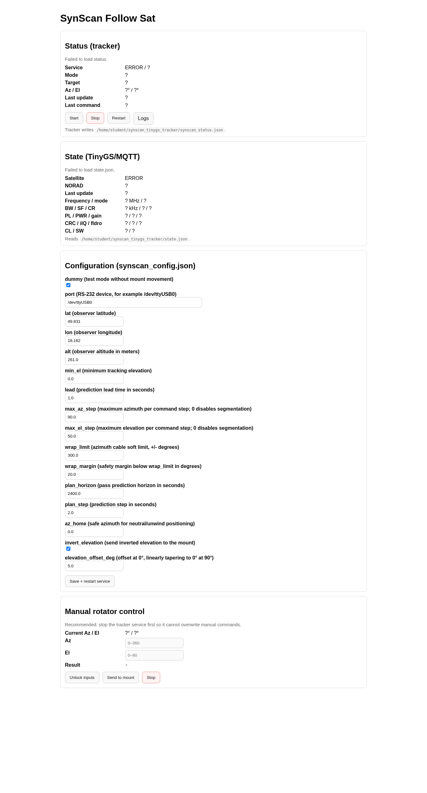

# SynScan TinyGS Tracker

This project tracks satellites with a SynScan mount, using TinyGS MQTT state updates and local TLE data.

## What This Is

- A Debian/Raspberry Pi control layer that connects TinyGS MQTT data with a SynScan antenna rotator.
- It reads the currently relevant satellite from TinyGS state updates, resolves it by NORAD, and computes azimuth/elevation from local TLE data.
- It moves a directional antenna automatically, while also exposing a web UI for status, config changes, logs, and manual override.
- It can store receive telemetry in InfluxDB/Grafana and can also run Passive 1 and Passive 2 TinyGS stations in parallel.
- The main use case is a LoRa satellite receive station with one tracked directional antenna and optional passive monitor antennas.

## Wiring Diagram


This diagram reflects the intended project layout: one directional station on a SynScan rotator, optional passive stations, and a Debian host that glues TinyGS, control, and observability together.

## Who Is This For

- People already running, or planning to run, a TinyGS-compatible LoRa receive station on Debian or Raspberry Pi.
- Users with a SynScan mount or rotator who want automatic satellite tracking instead of only manual pointing.
- Builders who want one machine to handle MQTT ingest, rotator control, a local web UI, and optional InfluxDB/Grafana telemetry.
- Operators who may use multiple RF paths: a directional tracked antenna plus Passive 1 or Passive 2 monitor antennas.

## Minimum Hardware Setup

- A Debian machine, typically a Raspberry Pi 5, with Python 3.10+ and `systemd`.
- One SynScan-compatible mount/rotator connected over serial or USB-to-serial.
- One directional antenna connected to a TinyGS-compatible ESP32 LoRa receiver.
- Network access from the Debian host to the TinyGS MQTT/API backend.
- Local TLE data and TinyGS credentials configured in this repository.

Optional but supported:

- Additional ESP32 LoRa receivers with passive antennas for Passive 1 or Passive 2 monitoring.
- InfluxDB and Grafana for telemetry, pass analysis, and dashboards.

## Platform Notes

- Tested on Raspberry Pi 5 (4 GB RAM).
- Tested on Debian GNU/Linux with `systemd`.
- This project is currently Debian-focused. Service files and setup steps in this README are prepared for Debian.
- The provided template units assume the repository is cloned to `$HOME/synscan_tinygs_tracker`.

## Components

- `synscan_follow_sat.py`: main tracker loop (select target, compute az/el, send mount commands).
- `synscan_runner.py`: validates `synscan_config.json` and starts tracker with safe arguments.
- `synscan_web.py`: Flask UI/API for config, service control, status, and manual goto/stop.
- `mqtt_tinygs_listen.py`: main TinyGS MQTT listener flow (callbacks, geo, Influx integration).
- `mqtt_ingest.py`: MQTT ingest helpers (client creation, topic/env parsing).
- `mqtt_filters.py`: frame parsing/filtering and satellite-name normalization.
- `mqtt_storage.py`: file/catalog/state serialization helpers used by the listener.
- `mqtt_geo.py`: TLE-based satellite lookup and geometry calculations.
- `import_requests.py`: downloads supported TinyGS satellites and writes local `satellites.tle`.
- `synscan_common.py`: shared serial protocol + az/el conversion utilities.
- `export_influx_csv.py`: exports TinyGS frame telemetry from configured InfluxDB buckets into CSV.
- `export_not_confirmed_passes.py`: exports pass-level CONFIRMED / NOT_CONFIRMED CSV summaries.

## Runtime Files

- `synscan_config.json`: tracker configuration used by `synscan_runner.py`.
- `state.json`: latest TinyGS state (updated by MQTT listener).
- `state_passive1.json`, `state_passive2.json`: latest passive station states when Passive 1 / Passive 2 listeners are enabled.
- `synscan_status.json`: live tracker status (updated by `synscan_follow_sat.py`).
- `satellites.tle`: local generated TLE dataset used for tracking.
- `all_rx.jsonl`: optional frame packet archive (only when listener is started with `--rx-out`).

## Clone Repository

```bash
git clone https://github.com/MiraKnapovsky/SynScan-Satellite-Tracker-TinyGS.git "$HOME/synscan_tinygs_tracker"
cd "$HOME/synscan_tinygs_tracker"
```

## Requirements

- Python 3.10+ (tested with Python 3.11).
- Access to serial port device (for real mount mode).
- Debian GNU/Linux with `systemd` (required for the provided service setup).

Install Python dependencies:

```bash
python3 -m pip install -r requirements.txt
```

## Ultimate Beginner Guide (From Zero to Running System)

Use this as the single end-to-end path on a new Debian machine.

1. Clone and enter the project (skip this if you already used the `Clone Repository` section above):

```bash
git clone https://github.com/MiraKnapovsky/SynScan-Satellite-Tracker-TinyGS.git "$HOME/synscan_tinygs_tracker"
cd "$HOME/synscan_tinygs_tracker"
```

2. Create virtual environment and install dependencies:

```bash
python3 -m venv tinygs_mqtt/env
source tinygs_mqtt/env/bin/activate
python -m pip install --upgrade pip
python -m pip install -r requirements.txt
```

3. Create local TinyGS credential file:

```bash
cp mqtt_tinygs_listen.env.example mqtt_tinygs_listen.env
```

Edit `mqtt_tinygs_listen.env` and fill in:
- `TINYGS_USER`
- `TINYGS_STATION`
- `TINYGS_PASS`

4. Download current TLE data locally (required before tracking):

```bash
python3 import_requests.py
```

5. Configure tracker in `synscan_config.json`:
- First safe setup: keep `dummy: true`.
- Real movement later: set `dummy: false` and confirm `port`, `lat`, `lon`, `alt`.
- Target selection reads `NORAD` from `state.json`.
- When `NORAD` is missing in `state.json`, tracker switches to surveillance/neutral position.
- Relative paths such as `satellites.tle`, `state.json`, and `synscan_status.json` are resolved relative to the project directory.

6. Load listener credentials into current shell:

```bash
set -a
source mqtt_tinygs_listen.env
set +a
```

7. Start MQTT listener manually (first validation run):

```bash
python3 mqtt_tinygs_listen.py \
  --user "$TINYGS_USER" \
  --station "$TINYGS_STATION" \
  --password "$TINYGS_PASS" \
  --out "$HOME/synscan_tinygs_tracker/state.json" \
  --frame-topic tinygs/${TINYGS_USER}/${TINYGS_STATION}/cmnd/frame/0
```

8. Verify that `state.json` is updating (open second terminal):

```bash
cat "$HOME/synscan_tinygs_tracker/state.json"
```

9. Start tracker loop (second terminal):

```bash
cd "$HOME/synscan_tinygs_tracker"
python3 synscan_runner.py
```

10. Start web UI (third terminal):

```bash
cd "$HOME/synscan_tinygs_tracker"
export SYNSCAN_WEB_PASSWORD=change-me
# optional:
# export SYNSCAN_WEB_USER=admin
# export SYNSCAN_WEB_HOST=0.0.0.0
# export SYNSCAN_WEB_PORT=8080
python3 synscan_web.py
```

Open `http://127.0.0.1:8080/config` locally.
If you set `SYNSCAN_WEB_HOST=0.0.0.0`, open `http://<debian-host-ip>:8080/config` from another machine.



The web UI is English-only and currently provides:

- live tracker status from `synscan_status.json`
- live TinyGS/MQTT state from `state.json`
- tracker service start/stop/restart buttons
- an editable safe subset of `synscan_config.json`
- manual rotator goto/stop controls for maintenance and testing
- a logs view backed by `journalctl -u <tracker-service>`

The form intentionally preserves advanced/path fields that are not shown in the UI.
Service buttons require the web process to have permission to run `systemctl` for the configured tracker unit.

11. Optional: install the template systemd units after the manual test passes:

```bash
sudo cp "$HOME/synscan_tinygs_tracker/mqtt_tinygs_listen@.service" /etc/systemd/system/
sudo cp "$HOME/synscan_tinygs_tracker/synscan-follow-sat@.service" /etc/systemd/system/
sudo cp "$HOME/synscan_tinygs_tracker/synscan-web@.service" /etc/systemd/system/
sudo systemctl daemon-reload
cp "$HOME/synscan_tinygs_tracker/synscan_web.env.example" "$HOME/synscan_tinygs_tracker/synscan_web.env"
editor "$HOME/synscan_tinygs_tracker/synscan_web.env"
sudo systemctl enable --now mqtt_tinygs_listen@$(whoami).service
sudo systemctl enable --now synscan-follow-sat@$(whoami).service
sudo systemctl enable --now synscan-web@$(whoami).service
sudo systemctl status mqtt_tinygs_listen@$(whoami).service \
  synscan-follow-sat@$(whoami).service \
  synscan-web@$(whoami).service
```

12. Optional: restart the template units manually:

```bash
sudo systemctl restart mqtt_tinygs_listen@$(whoami).service
sudo systemctl restart synscan-follow-sat@$(whoami).service
sudo systemctl restart synscan-web@$(whoami).service
sudo systemctl status mqtt_tinygs_listen@$(whoami).service \
  synscan-follow-sat@$(whoami).service \
  synscan-web@$(whoami).service
```

The web UI can start/stop/restart the tracker service automatically when:

- `synscan_web.py` knows the correct tracker unit via `SYNSCAN_FOLLOW_SERVICE`
- the web process has permission to manage system services

The provided `synscan-web@.service` sets `SYNSCAN_FOLLOW_SERVICE=synscan-follow-sat@<user>.service`.
For service control actions on Debian, the web process still needs permission to run `systemctl` as root.

13. Optional: if you want only the listener as a service:

```bash
sudo systemctl enable --now mqtt_tinygs_listen@$(whoami).service
sudo systemctl status mqtt_tinygs_listen@$(whoami).service
```

## InfluxDB + Grafana

`mqtt_tinygs_listen.py` can write directly to InfluxDB v2 (optional):

- Measurement `tinygs_state`: data from topic `cmnd/begine` (mode, freq, bw, sf, cr, NORAD, ...).
- Measurement `tinygs_frame`: data from topic `cmnd/frame/0` (satellite, RSSI, SNR, freq error, confirmed/crc_error).


Included dashboards:

- `dashboards/tinygs-active-overview.json`
- `dashboards/tinygs-passive1-overview.json`
- `dashboards/tinygs-passive2-overview.json`

Each station also has `no-tianqi`, `only-tianqi`, and `common-no-tianqi` dashboard variants.
See `README_GRAFANA.md` for panel definitions and deployment steps.

Configuration is via env vars (already loaded by `mqtt_tinygs_listen@.service`):

```bash
# $HOME/synscan_tinygs_tracker/mqtt_tinygs_listen.env
INFLUXDB_URL=http://127.0.0.1:8086
INFLUXDB_ORG=your-org
INFLUXDB_BUCKET=tinygs_active
INFLUXDB_TOKEN=your-token
INFLUXDB_MEAS_FRAME=tinygs_frame
INFLUXDB_MEAS_STATE=tinygs_state
INFLUXDB_MEAS_META=tinygs_meta
# Optional custom CA bundle for MQTT TLS (when unset, system trust store is used)
TINYGS_CAFILE=/path/to/ca-bundle.pem
# Optional: tracker status source used to stamp tracked_norad into Influx points
TINYGS_TRACKER_STATUS_FILE=/home/<user>/synscan_tinygs_tracker/synscan_status.json
TINYGS_TRACKER_STATUS_MAX_AGE_S=10
```

Then restart listener:

```bash
sudo systemctl daemon-reload
sudo systemctl restart mqtt_tinygs_listen@$(whoami).service
sudo systemctl status mqtt_tinygs_listen@$(whoami).service
```

Portable multi-user variant (recommended for new deployments):

```bash
# install template unit
sudo cp "$HOME/synscan_tinygs_tracker/mqtt_tinygs_listen@.service" /etc/systemd/system/
sudo systemctl daemon-reload

# start for target linux user account (example: alice)
sudo systemctl enable --now mqtt_tinygs_listen@alice.service
sudo systemctl status mqtt_tinygs_listen@alice.service
```

## Additional MQTT Stations (Grafana Only)

This project now has a simple three-station layout:

- Actively directed station: recommended `mqtt_tinygs_listen@.service`, writes `state.json` for the rotator.
- Passive 1 station: new `mqtt_tinygs_listen_passive1@.service`, writes to a separate bucket and never affects the rotator.
- Passive 2 station: new `mqtt_tinygs_listen_passive2@.service`, writes to its own bucket and never affects the rotator.

Prepare env file for the Passive 1 station:

```bash
cp "$HOME/synscan_tinygs_tracker/mqtt_tinygs_listen_passive1.env.example" \
  "$HOME/synscan_tinygs_tracker/mqtt_tinygs_listen_passive1.env"
```

MQTT login stays the same as for the rotator station:

- keep the same `TINYGS_USER`
- keep the same `TINYGS_PASS`
- change only `TINYGS_STATION` to `YOUR_PASSIVE1_STATION`
- use a different `INFLUXDB_BUCKET`

Recommended values for `YOUR_PASSIVE1_STATION`:

```bash
TINYGS_USER=YOUR_USER_ID
TINYGS_STATION=YOUR_PASSIVE1_STATION
TINYGS_PASS=YOUR_PASSWORD
INFLUXDB_URL=http://127.0.0.1:8086
INFLUXDB_ORG=your-org
INFLUXDB_BUCKET=tinygs_passive1
INFLUXDB_TOKEN=your-token
INFLUXDB_MEAS_FRAME=tinygs_frame
INFLUXDB_MEAS_STATE=tinygs_state
INFLUXDB_MEAS_META=tinygs_meta
TINYGS_TRACKER_STATUS_FILE=
```

Fastest setup is usually:

```bash
cp "$HOME/synscan_tinygs_tracker/mqtt_tinygs_listen.env" \
  "$HOME/synscan_tinygs_tracker/mqtt_tinygs_listen_passive1.env"
```

Then edit only:

- `TINYGS_STATION=YOUR_PASSIVE1_STATION`
- `INFLUXDB_BUCKET=tinygs_passive1`
- `TINYGS_TRACKER_STATUS_FILE=`

Manual test run for the Passive 1 station:

```bash
set -a
source "$HOME/synscan_tinygs_tracker/mqtt_tinygs_listen_passive1.env"
set +a
python3 "$HOME/synscan_tinygs_tracker/mqtt_tinygs_listen.py" \
  --user "$TINYGS_USER" \
  --station "$TINYGS_STATION" \
  --password "$TINYGS_PASS" \
  --out "$HOME/synscan_tinygs_tracker/state_passive1.json" \
  --confirmed-catalog-out "$HOME/synscan_tinygs_tracker/confirmed_satellites_passive1.json" \
  --frame-topic tinygs/${TINYGS_USER}/${TINYGS_STATION}/cmnd/frame/0
```

Install and start passive systemd service:

```bash
sudo cp "$HOME/synscan_tinygs_tracker/mqtt_tinygs_listen_passive1@.service" /etc/systemd/system/
sudo systemctl daemon-reload
sudo systemctl enable --now mqtt_tinygs_listen_passive1@$(whoami).service
sudo systemctl status mqtt_tinygs_listen_passive1@$(whoami).service
```

Useful log command:

```bash
journalctl -u mqtt_tinygs_listen_passive1@$(whoami).service -f
```

Ready-made Grafana dashboard:

- `dashboards/tinygs-passive1-overview.json`

This passive service always:

- writes to `state_passive1.json` instead of `state.json`
- writes its own confirmed catalog to `confirmed_satellites_passive1.json`
- keeps tracker status stamping disabled when `TINYGS_TRACKER_STATUS_FILE=` is empty
- keeps geo enrichment enabled when gateway location and TLE data are available
- uses whatever `INFLUXDB_BUCKET` you set in `mqtt_tinygs_listen_passive1.env`

Grafana setup:

1. Add data source `InfluxDB` (Flux or InfluxQL according to your Influx setup).
2. Select the station bucket you configured, for example `tinygs_active`, `tinygs_passive1`, or `tinygs_passive2`.
3. Build panels from:
   - `tinygs_frame`: `rssi_db`, `snr_db`, `freq_error_hz`, `confirmed`, `crc_error` by `satellite`.
   - `tinygs_state`: `freq`, `bw`, `sf`, `cr` by `satellite`.

Detailed dashboard documentation:

- `README_GRAFANA.md`

### Passive 2 MQTT Station (`YOUR_PASSIVE2_STATION`, Grafana Only)

Prepare env file for the Passive 2 station:

```bash
cp "$HOME/synscan_tinygs_tracker/mqtt_tinygs_listen_passive2.env.example" \
  "$HOME/synscan_tinygs_tracker/mqtt_tinygs_listen_passive2.env"
```

Recommended values for `YOUR_PASSIVE2_STATION`:

```bash
TINYGS_USER=YOUR_USER_ID
TINYGS_STATION=YOUR_PASSIVE2_STATION
TINYGS_PASS=YOUR_PASSWORD
INFLUXDB_URL=http://127.0.0.1:8086
INFLUXDB_ORG=your-org
INFLUXDB_BUCKET=tinygs_passive2
INFLUXDB_TOKEN=your-token
INFLUXDB_MEAS_FRAME=tinygs_frame
INFLUXDB_MEAS_STATE=tinygs_state
INFLUXDB_MEAS_META=tinygs_meta
TINYGS_TRACKER_STATUS_FILE=
```

Fastest setup is usually:

```bash
cp "$HOME/synscan_tinygs_tracker/mqtt_tinygs_listen.env" \
  "$HOME/synscan_tinygs_tracker/mqtt_tinygs_listen_passive2.env"
```

Then edit only:

- `TINYGS_STATION=YOUR_PASSIVE2_STATION`
- `INFLUXDB_BUCKET=tinygs_passive2`
- `TINYGS_TRACKER_STATUS_FILE=`

Manual test run for the Passive 2 station:

```bash
set -a
source "$HOME/synscan_tinygs_tracker/mqtt_tinygs_listen_passive2.env"
set +a
python3 "$HOME/synscan_tinygs_tracker/mqtt_tinygs_listen.py" \
  --user "$TINYGS_USER" \
  --station "$TINYGS_STATION" \
  --password "$TINYGS_PASS" \
  --out "$HOME/synscan_tinygs_tracker/state_passive2.json" \
  --confirmed-catalog-out "$HOME/synscan_tinygs_tracker/confirmed_satellites_passive2.json" \
  --frame-topic tinygs/${TINYGS_USER}/${TINYGS_STATION}/cmnd/frame/0
```

Install and start the Passive 2 systemd service:

```bash
sudo cp "$HOME/synscan_tinygs_tracker/mqtt_tinygs_listen_passive2@.service" /etc/systemd/system/
sudo systemctl daemon-reload
sudo systemctl enable --now mqtt_tinygs_listen_passive2@$(whoami).service
sudo systemctl status mqtt_tinygs_listen_passive2@$(whoami).service
```

Useful log command:

```bash
journalctl -u mqtt_tinygs_listen_passive2@$(whoami).service -f
```

Ready-made Grafana dashboard:

- `dashboards/tinygs-passive2-overview.json`

## CSV Exports

Two helper scripts export InfluxDB data to local CSV files:

- `export_influx_csv.py`: frame telemetry rows from `tinygs_frame`
- `export_not_confirmed_passes.py`: pass-level `CONFIRMED` and `NOT_CONFIRMED` summaries

Both scripts read InfluxDB connection settings from these local env files:

- `mqtt_tinygs_listen.env` for source `active`
- `mqtt_tinygs_listen_passive1.env` for source `passive1`
- `mqtt_tinygs_listen_passive2.env` for source `passive2`

Example:

```bash
python3 export_influx_csv.py \
  --start "2026-04-16 11:00" \
  --stop "2026-04-18 12:00" \
  --sources active,passive1,passive2

python3 export_not_confirmed_passes.py \
  --start "2026-04-16 11:00" \
  --stop "2026-04-18 12:00" \
  --sources all
```

By default, output goes under `exports/<start>_to_<stop>_<timezone>/`.
Generated export directories are ignored by git.

## `synscan_config.json` Keys

- `dummy`: `true` to log commands only (no serial writes).
- `port`: serial port path (for real mode), e.g. `/dev/ttyUSB0`.
- `lat`, `lon`, `alt`: observer location.
- `tle`: path to TLE file. Relative paths are resolved against the project directory.
- `state`: path to TinyGS state file (`state.json`) used for NORAD target selection. Relative paths are resolved against the project directory.
- `min_el`: minimum elevation threshold.
- `interval`: control loop period in seconds.
- `lead`: prediction lead time in seconds.
- `max_az_step`, `max_el_step`: per-command move caps for segmented long slews; `0` disables the cap.
- `wrap_limit`, `wrap_margin`, `plan_horizon`, `plan_step`, `az_home`: cable-wrap planning controls.
- `elevation_offset_deg`: extra elevation added at `0°`, linearly tapering to `0°` at `90°`.
- `invert_elevation`: if `true`, the tracker sends elevation to the mount as `90 - el`.
- `status_file`, `status_every`: tracker status JSON path and write interval.

Web UI note:
- Some advanced/path fields are intentionally hidden in `/config` (`tle`, `state`, `status_file`, `interval`, `status_every`).
- Hidden fields are preserved from existing `synscan_config.json` when saving.
- `synscan_follow_sat.py` also has CLI-only defaults such as `--min-step` and `--center-el`; the default systemd runner currently uses those defaults.

## Web Auth

`synscan_web.py` uses HTTP Basic Auth:

- `SYNSCAN_WEB_PASSWORD`: required password (no insecure default).
- `SYNSCAN_WEB_USER`: optional username. If empty, only password is checked.
- `SYNSCAN_WEB_HOST`: optional bind host (default: `127.0.0.1`).
- `SYNSCAN_WEB_PORT`: optional bind port (default: `8080`).
- `SYNSCAN_FOLLOW_SERVICE`: optional tracker unit name for the web service-control buttons.

POST protection:
- All web `POST` actions use CSRF protection.
- Browser form actions work normally.
- Custom API clients must send `X-CSRF-Token` matching the `synscan_csrf` cookie.

## Services

`synscan_web.py` controls the tracker service via `systemctl`.
For new Debian deployments, use:

- `mqtt_tinygs_listen@.service`
- `synscan-follow-sat@.service`
- `synscan-web@.service`

For the Passive 1 Grafana-only station, use `mqtt_tinygs_listen_passive1@.service`.
For the Passive 2 Grafana-only station, use `mqtt_tinygs_listen_passive2@.service`.
